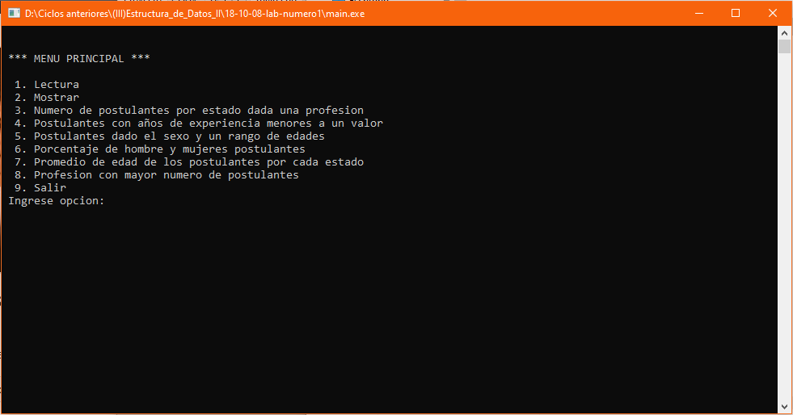

# Postulantes profesionales
Sistema de control de postulantes profesionales que permite ingresar los datos del postulante, mostrar estos datos, mostrar la cantidad de postulantes con y sin trabajo según una profesión, mostrar los postulantes con años de experiencia menores a un número indicado, mostrar los postulantes según el sexo y un rango de edades, mostrar el porcentaje de postulantes por sexo, promediar las edades de postulantes con y sin trabajo, y mostrar la profesión con mayor número de postulantes, **08/10/18**.

<strong>Imagen:</strong> Menú principal.

